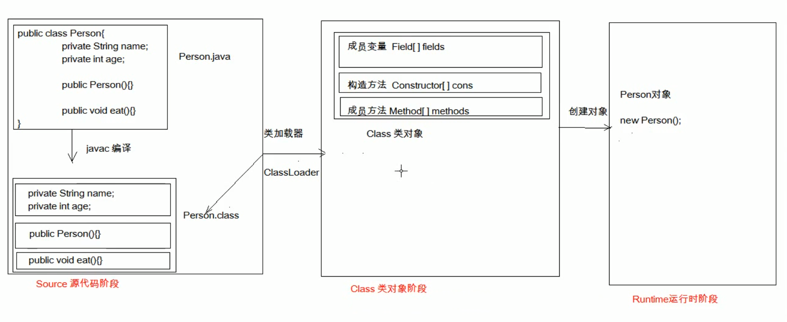

# 反射

[TOC]

## 简介

**框架的灵魂**

- 框架： 半成品软件，可以在框架的基础上进行软件开发，简化代码
- 反射： 将类的各个组成部分封装成其他对象，这就是反射机制

### 1.反射的好处

1. 可以在程序运行过程中，操作这些对象（如：Idea中编译器自动提示就是运用了反射）
2. 可以解耦，提高程序的可扩展性


## 获取方式

### **1.加载阶段**

```java
1: Class.forName("全类名"); //将字节码文件加载进内存，返回Class对象
   多用于配置文件
2: 类名.class //通过类名的属性Class获取
   多用于参数的传递
3: 对象.getClass //getClass 在Object中定义
   多用于获取字节码对象
```




###  2.实例

```java
import model.Person;

public class ReflectDemo {

    public static void main(String[] args) throws ClassNotFoundException {
        //1.全类名 Class.forName("全类名")
        Class personClazz = Class.forName("model.Person");
        System.out.println(personClazz);

        //类名.class
        Class personCla = Person.class;
        System.out.println(personCla);

        //对象.getClass
        Person person = new Person();
        Class personCl = person.getClass();
        System.out.println(personCla);

        //同一个字节码文件 在程序运行过程中只会加载一次 不论通过哪种方式获取Class对象都是同一个
        System.out.println(personCla == personCl && personCl == personClazz);

        Person person1 = new Person();
        Class personCl1 = person1.getClass();
        System.out.println(personCl1 == personCl);
    }
}

```


## Class对象功能

### 1.获取成员变量

```markdown
Field[] getFields(); //获取public修饰的成员变量
Field[] getField(String name);

Field[] getDeclaredFileds();//获取所有的成员变量
Field[] getDeclaredField(String name);
```
#### Field操作

1. 获取值 
   * get(Object obj)
2. 设置值
   * void set(Object obj, Object value)
3. 忽略访问权限修饰符的安全检查(暴力反射)
   * setAccessible(true); 


#### Filed示例

```java
import model.Person;

import java.lang.reflect.Field;
import java.util.Arrays;

/**
 * Field[] getFields(); //获取public修饰的成员变量
 * Field[] getField(String name);
 * Field[] getDeclaredFileds();//获取所有的成员变量
 * Field[] getDeclaredField(String name);
 */
public class ReflectField {
    public static void main(String[] args) throws Exception {
        //三种方式获得Class
        Class personClazz =  Class.forName("model.Person");
        Class personCLa =  Person.class;
        Person person = new Person();
        Class personCl = person.getClass();

        //通过Class获取public修饰符的Filed
        Arrays.stream(personClazz.getFields()).forEach(e->System.out.println(e));

        /**
         *得到 特定的Field name='sex' 区分大小写
         * 为该field设值
         */
        Field field = personClazz.getField("sex");
        field.set(person,"男");
        System.out.println(field.get(person));

        //通过Class 得到该类的所有属性
        Arrays.stream(personCLa.getDeclaredFields()).forEach(e-   			                 
        >System.out.println(e));

        /**
         *得到private修饰的Field name='name' 区分大小写
         * 为该field设值
         */
        Field deField = personClazz.getDeclaredField("name");
        //忽略访问权限修饰符,暴力反射
        deField.setAccessible(true);
        deField.set(person,"star");
        System.out.println(deField.get(person));
    }
}

```


### 2.获取构造方法

```markdown
Constructor<?> getConstructors();
Constructor<T> getConstructor(Class<?>... parameterTypes) //Class<?>... parameterTypes 列表的可变参
Constructor<?>[] getDeclaredConstructors();
Constructor<T> getDeclaredConstructor(Class<?>... parameterTypes)
```

#### Constructor操作

1. 创建对象 constructor.newInstance();

#### Constructor示例

```java
import model.Person;

import java.lang.reflect.Constructor;
import java.lang.reflect.Field;
import java.util.Arrays;

/**
 *Constructor<?> getConstructors();
 *Constructor<T> getConstructor(Class<?>... parameterTypes)
 *Constructor<?>[] getDeclaredConstructors();
 *Constructor<T> getDeclaredConstructor(Class<?>... parameterTypes)
 */
public class ReflectConstuctor {
    public static void main(String[] args) throws Exception {
        //三种方式获得Class
        Class personClazz =  Class.forName("model.Person");
        Class personCLa =  Person.class;

        //通过Class获取public修饰的Constructor
        Arrays.stream(personClazz.getConstructors()).forEach(cons-                           
        >System.out.println(cons));
        /**
         * 得到特定的Constructor
         * 首先得到无参的构造方法 并创建对象
         */
        Constructor constructor = personClazz.getConstructor();
        Object person = constructor.newInstance();
        System.out.println(person);

        //通过Class获取所有的Constructor
        Arrays.stream(personClazz.getDeclaredConstructors()).forEach(cons-                   
        >System.out.println(cons));

        //得到一个拥有name 和 age 的constructor
        Constructor privateConstructor =                                                      personClazz.getDeclaredConstructor(String.class,int.class);
        //忽略访问权限修饰符
        privateConstructor.setAccessible(true);
        Object privatePerson = privateConstructor.newInstance("star",29);
        System.out.println(privatePerson);
    }
}

```


### 3.获取成员方法

```markdown
Method[] getMethods();
Method getMethod(String name, Class<?>... parameterTypes)

Method[] getDeclaredMethods();
Method getDeclaredMethod(String name, Class<?>... parameterTypes)
```

#### Method操作

1. 执行方法 method.invoke();
2. 获取方法名 method.getName();

#### Method示例

```java
import model.Person;

import java.lang.reflect.Constructor;
import java.lang.reflect.Method;
import java.util.Arrays;

/**
 *Method[] getMethods();
 *Method getMethod(String name, Class<?>... parameterTypes)
 *Method[] getDeclaredMethods();
 *Method getDeclaredMethod(String name, Class<?>... parameterTypes)
 */
public class ReflectMethod {
    public static void main(String[] args) throws Exception {
        //获得Class
        Class personCLa =  Person.class;
        //通过Class获取public修饰的Method
        Arrays.stream(personCLa.getMethods()).forEach(method-                                 
        >System.out.println(method));
        Arrays.stream(personCLa.getMethods()).forEach(method-                                 
        >System.out.print(method.getName()));
        /**
         * 得到特定的Method
         * 执行方法invoke();
         */
        Method method = personCLa.getMethod("eat");
        method.invoke(personCLa.newInstance());

        Method method2 = personCLa.getMethod("eat",String.class);
        method2.invoke(personCLa.newInstance(),"rice");
    }
}
```


### 4.获取类名

```mark
String getName();
```

```java
//获取类名
String className = personCLa.getName();
```

